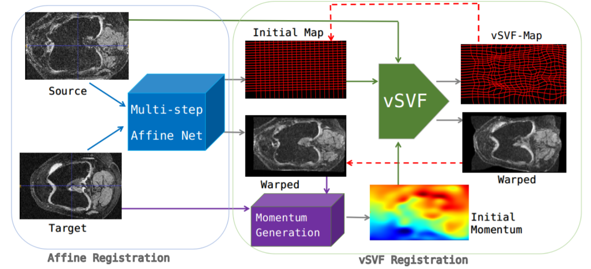

# Image registration

The purpose of this repository is to provide an overview of github repositories on non-parametric image registration.

# Mermaid: iMagE Registration via autoMAtIc Differentiation

<pre>
                                      _     _ 
                                     (_)   | |
  _ __ ___   ___ _ __ _ __ ___   __ _ _  __| |
 | '_ ` _ \ / _ \ '__| '_ ` _ \ / _` | |/ _` |
 | | | | | |  __/ |  | | | | | | (_| | | (_| |
 |_| |_| |_|\___|_|  |_| |_| |_|\__,_|_|\__,_|
                                                                                      
 </pre>                                       

Mermaid is a registration toolkit making use of automatic differentiation for rapid prototyping.
It includes various image registration models. In particular, stationary velocity field models
 (both based on velocity fields and momentum fields), scalar vector momentum Large
  Displacement Diffeomorphic Metric Mapping (LDDMM) models as well as the more generalized Region-specific Diffeomorphic Metric Mapping model (RDMM).

The Mermaid repository can be found here:
https://github.com/uncbiag/mermaid

**Method support list**:
* SVFImageNet: image-based stationary velocity field
* SVFMapNet: map-based stationary velocity field
* SVFQuasiMomentumImageNet: EXPERIMENTAL (not working yet): SVF which is parameterized by a momentum
* SVFScalarMomentumImageNet: image-based SVF using the scalar-momentum parameterization
* SVFScalarMomentumMapNet: map-based SVF using the scalar-momentum parameterization
* SVFVectorMomentumImageNet: image-based SVF using the vector-momentum parameterization
* SVFVectorMomentumMapNet: map-based SVF using the vector-momentum parameterization
* CVFVectorMomentumMapNet: map-based CVF using the vector-momentum parameterization
* LDDMMShootingVectorMomentumImageNet: image-based LDDMM using the vector-momentum parameterization
* LDDMMShootingVectorMomentumMapNet: map-based LDDMM using the vector-momentum parameterization
* LDDMMShootingScalarMomentumImageNet: image-based LDDMM using the scalar-momentum parameterization
* LDDMMShootingScalarMomentumMapNet: map-based LDDMM using the scalar-momentum parameterization
* LDDMMShootingScalarMomentumMapNet: map-based LDDMM using the scalar-momentum parameterization
* LDDMMShootingScalarMomentumMapNet: map-based LDDMM using the scalar-momentum parameterization
* LDDMMVectorAdaptiveSmootherMomentumMapNet: map-based LDDMM using the vector-momentum parameterization and advected regularizer

**Solver support list**:
* embedded RK4
* torchdiffeq: explicit_adams, fixed_adams, tsit5, dopri5, euler, midpoint, rk4

**Optimizer**:
* support single/multi-scale optimizer
* support SGD, l-BFGS and some limited support for adam

# EasyReg

EasyReg is an extension that builds on Mermaid, providing a simple interface to Mermaid and other popluar registration packages.

The currently supported methods include Mermaid-optimization (i.e., optimization-based registration) and Mermaid-network (i.e., deep network-based registration methods using the mermaid deformation models, like SVF, LDDMM, RDMM...).
We also added some supports on [ANTsPy](https://github.com/ANTsX/ANTsPy), [NiftyReg](http://cmictig.cs.ucl.ac.uk/wiki/index.php/NiftyReg) and Demons(embedded in [SimpleITK](http://www.simpleitk.org/SimpleITK/resources/software.html)).

The EasyReg repository can be found here:
https://github.com/uncbiag/easyreg

# Related work

Metric Learning for Image Registration [[link]](https://arxiv.org/pdf/1904.09524.pdf)\
Marc Niethammer, Roland Kwitt, Francois-Xavier Vialard. CVPR 2019

 

Networks for Joint Affine and Non-parametric Image Registration [[link]](https://arxiv.org/pdf/1903.08811.pdf)\
Zhengyang Shen, Xu Han, Zhenlin Xu, Marc Niethammer. CVPR 2019.

 

Region-specific Diffeomorphic Metric Mapping [[link]](https://arxiv.org/pdf/1906.00139.pdf)\
Zhengyang Shen, François-Xavier Vialard, Marc Niethammer. NeurIPS 2019.

 

